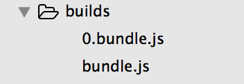
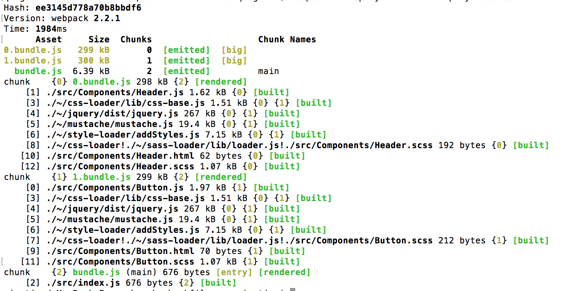
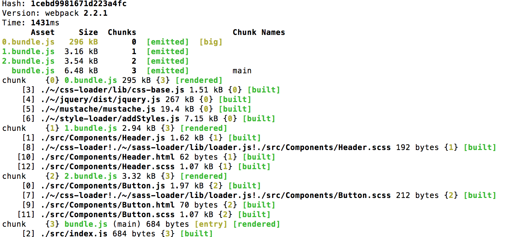
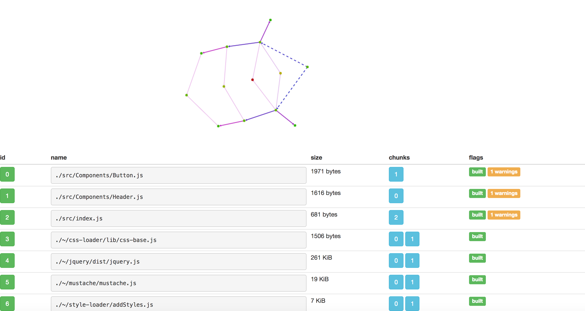

### 1.webpack打包时候添加参数

#### --display-modules
 
 这时候，我们在控制台中输出的 "+ 1 hidden modules"都会显示出来

#### --watch

监控文件的变化并自动编译。

#### --display-chunks

显示一个chunk中包含的模块。


### 2.使用require.default来手动获取导出对象

当我们使用require的时候，如果你想要获取默认导出的对象你可以使用.default来获取。理由是：require不会同时处理default导出和常规导出，所以你要自己指定返回值。

### 3.code splitting

#### 3.1 示例代码

我们的webpack配置如下:

```js
module.exports = {
    entry:  './src',
    output: {
        path:     'builds',
        filename: 'bundle.js',
        publicPath: 'builds/'
    },
    module: {
         loaders: [
           {
                test:    /\.js/,
                loader:  'babel-loader',
                include: __dirname + '/src',
            },
            {
                test:   /\.scss/,
                loader: 'style-loader!css-loader!sass-loader',
                // Or
               // loaders: ['style', 'css', 'sass'],
               //这里必须是loader后缀
            },
            {
                test:   /\.html/,
                loader: 'html-loader',
            }
        ],
    }
};
```

通过output.publicPath指定html加载资源的路径。此时为了达到按需加载，我们在页面中做了一个判断，如果页面中有a标签那么我们才会加载：

```js
if (document.querySelectorAll('a').length) {
    require.ensure([], () => {
        const Button = require('./Components/Button').default;
        const button = new Button('google.com');
        button.render('a');
    });
}
```

此时我们的builds目录会产生两个文件，其中0.bundle.js只有在具有a标签的时候才会加载，也就是表示按需加载的资源。



#### 3.2 chunkFilename为按需加载的文件命名

可以为我们的webpack配置添加chunkFilename取代上面的0.bundle.js，修改如下，重新编译你会发现生成了文件是bundle.js和chunkfile.js。

```js
   output: {
        path:     'builds',
        filename: 'bundle.js',
        publicPath: 'builds/',
        chunkFilename:'chunkfile.js'
    }
```


#### 3.3 一个稍微复杂点的例子

修改index.js如下:

```js
if (document.querySelectorAll('a').length) {
    require.ensure([], () => {
        const Button = require('./Components/Button').default;
        const button = new Button('google.com');

        button.render('a');
    });
}
if (document.querySelectorAll('h1').length) {
    require.ensure([], () => {
        const Header = require('./Components/Header');

        new Header().render('h1');
    });
}
```

执行如下命令 webpack --display-chunks --display-modules，然后查看结果：



通过上图你可以清楚的看到那些chunk，以及chunk包含的模块。

首先：我们的bundle.js只是包含一些webpack的逻辑代码，也就是仅仅包含如下代码的打包结果：

```js
if (document.querySelectorAll('a').length) {
    require.ensure([], () => {
        const Button = require('./Components/Button').default;
        const button = new Button('google.com');

        button.render('a');
    });
}

if (document.querySelectorAll('h1').length) {
    require.ensure([], () => {
        const Header = require('./Components/Header');

        new Header().render('h1');
    });
}
```

在builds/bundle.js的打包结果如下:

```js
/******/ (function(modules) { // webpackBootstrap
/******/    // install a JSONP callback for chunk loading
/******/    var parentJsonpFunction = window["webpackJsonp"];
/******/    window["webpackJsonp"] = function webpackJsonpCallback(chunkIds, moreModules, executeModules) {
/******/        // add "moreModules" to the modules object,
/******/        // then flag all "chunkIds" as loaded and fire callback
/******/        var moduleId, chunkId, i = 0, resolves = [], result;
/******/        for(;i < chunkIds.length; i++) {
/******/            chunkId = chunkIds[i];
/******/            if(installedChunks[chunkId])
/******/                resolves.push(installedChunks[chunkId][0]);
/******/            installedChunks[chunkId] = 0;
/******/        }
/******/        for(moduleId in moreModules) {
/******/            if(Object.prototype.hasOwnProperty.call(moreModules, moduleId)) {
/******/                modules[moduleId] = moreModules[moduleId];
/******/            }
/******/        }
/******/        if(parentJsonpFunction) parentJsonpFunction(chunkIds, moreModules, executeModules);
/******/        while(resolves.length)
/******/            resolves.shift()();

/******/    };

/******/    // The module cache
/******/    var installedModules = {};

/******/    // objects to store loaded and loading chunks
/******/    var installedChunks = {
/******/        2: 0
/******/    };

/******/    // The require function
/******/    function __webpack_require__(moduleId) {

/******/        // Check if module is in cache
/******/        if(installedModules[moduleId])
/******/            return installedModules[moduleId].exports;

/******/        // Create a new module (and put it into the cache)
/******/        var module = installedModules[moduleId] = {
/******/            i: moduleId,
/******/            l: false,
/******/            exports: {}
/******/        };

/******/        // Execute the module function
/******/        modules[moduleId].call(module.exports, module, module.exports, __webpack_require__);

/******/        // Flag the module as loaded
/******/        module.l = true;

/******/        // Return the exports of the module
/******/        return module.exports;
/******/    }

/******/    // This file contains only the entry chunk.
/******/    // The chunk loading function for additional chunks
/******/    __webpack_require__.e = function requireEnsure(chunkId) {
/******/        if(installedChunks[chunkId] === 0)
/******/            return Promise.resolve();

/******/        // an Promise means "currently loading".
/******/        if(installedChunks[chunkId]) {
/******/            return installedChunks[chunkId][2];
/******/        }
/******/        // start chunk loading
/******/        var head = document.getElementsByTagName('head')[0];
/******/        var script = document.createElement('script');
/******/        script.type = 'text/javascript';
/******/        script.charset = 'utf-8';
/******/        script.async = true;
/******/        script.timeout = 120000;

/******/        if (__webpack_require__.nc) {
/******/            script.setAttribute("nonce", __webpack_require__.nc);
/******/        }
/******/        script.src = __webpack_require__.p + "" + chunkId + ".bundle.js";
/******/        var timeout = setTimeout(onScriptComplete, 120000);
/******/        script.onerror = script.onload = onScriptComplete;
/******/        function onScriptComplete() {
/******/            // avoid mem leaks in IE.
/******/            script.onerror = script.onload = null;
/******/            clearTimeout(timeout);
/******/            var chunk = installedChunks[chunkId];
/******/            if(chunk !== 0) {
/******/                if(chunk) chunk[1](new Error('Loading chunk ' + chunkId + ' failed.'));
/******/                installedChunks[chunkId] = undefined;
/******/            }
/******/        };

/******/        var promise = new Promise(function(resolve, reject) {
/******/            installedChunks[chunkId] = [resolve, reject];
/******/        });
/******/        installedChunks[chunkId][2] = promise;

/******/        head.appendChild(script);
/******/        return promise;
/******/    };

/******/    // expose the modules object (__webpack_modules__)
/******/    __webpack_require__.m = modules;

/******/    // expose the module cache
/******/    __webpack_require__.c = installedModules;

/******/    // identity function for calling harmony imports with the correct context
/******/    __webpack_require__.i = function(value) { return value; };

/******/    // define getter function for harmony exports
/******/    __webpack_require__.d = function(exports, name, getter) {
/******/        if(!__webpack_require__.o(exports, name)) {
/******/            Object.defineProperty(exports, name, {
/******/                configurable: false,
/******/                enumerable: true,
/******/                get: getter
/******/            });
/******/        }
/******/    };

/******/    // getDefaultExport function for compatibility with non-harmony modules
/******/    __webpack_require__.n = function(module) {
/******/        var getter = module && module.__esModule ?
/******/            function getDefault() { return module['default']; } :
/******/            function getModuleExports() { return module; };
/******/        __webpack_require__.d(getter, 'a', getter);
/******/        return getter;
/******/    };

/******/    // Object.prototype.hasOwnProperty.call
/******/    __webpack_require__.o = function(object, property) { return Object.prototype.hasOwnProperty.call(object, property); };

/******/    // __webpack_public_path__
/******/    __webpack_require__.p = "builds/";

/******/    // on error function for async loading
/******/    __webpack_require__.oe = function(err) { console.error(err); throw err; };

/******/    // Load entry module and return exports
/******/    return __webpack_require__(__webpack_require__.s = 2);
/******/ })
/************************************************************************/
/******/ ({

/***/ 2:
/***/ (function(module, exports, __webpack_require__) {

"use strict";
//code splitting
if (document.querySelectorAll('a').length) {
    __webpack_require__.e/* require.ensure */(1).then((function () {
        var Button = __webpack_require__(0).default;
        var button = new Button('google.com');

        button.render('a');
    }).bind(null, __webpack_require__)).catch(__webpack_require__.oe);
}

if (document.querySelectorAll('h1').length) {
    __webpack_require__.e/* require.ensure */(0).then((function () {
        var Header = __webpack_require__(1);

        new Header().render('h1');
    }).bind(null, __webpack_require__)).catch(__webpack_require__.oe);
}

/***/ })
/******/ });
```

第二:通过添加--display-chunks --display-modules参数你可以明确的看出其他两个chunk都重复的包含了jQuery和Mustache模块，这部分内容就是我们要通过commonChunkPlugin来完成！

（1）code splitting的时候指定name:'main'

```js
var webpack = require('webpack');
module.exports = {
    entry:   './src',
    output:  {
      // ...
    },
    plugins: [
        new webpack.optimize.CommonsChunkPlugin({
            name:      'main', 
            // Move dependencies to our main file
            //也就是我们的src/index.js，所以这里指定main会把公有的内容移到这个文件中
            children:  true, // Look for common dependencies in all children,
            minChunks: 2, // How many times a dependency must come up before being extracted
        }),
    ],
    module:  {
      // ...
    }
};
```

上面我们配置的是:

```js
new webpack.optimize.CommonsChunkPlugin({
            name:      'main', 
            // Move dependencies to our main file
            //也就是我们的src/index.js，所以这里指定main会把公有的内容移到这个文件中
            children:  true, // Look for common dependencies in all children,
            minChunks: 2, // How many times a dependency must come up before being extracted
        }),
```

其中name指定了‘main’，所以我们会把公有的模块内容打包到bundle.js中(bundle.js是我们配置在webpack中的output.filename，所以'main'就是指定的是我们的打包文件bundle.js，而不是require.ensure指定的文件)：

<pre>
chunk    {0} 0.bundle.js 2.94 kB {2} [rendered]
    [1] ./src/Components/Header.js 1.62 kB {0} [built]
    [8] ./~/css-loader!./~/sass-loader/lib/loader.js!./src/Components/Header.scss 192 bytes {0} [built]
   [10] ./src/Components/Header.html 62 bytes {0} [built]
   [12] ./src/Components/Header.scss 1.07 kB {0} [built]
chunk    {1} 1.bundle.js 3.32 kB {2} [rendered]
    [0] ./src/Components/Button.js 1.97 kB {1} [built]
    [7] ./~/css-loader!./~/sass-loader/lib/loader.js!./src/Components/Button.scss 212 bytes {1} [built]
    [9] ./src/Components/Button.html 70 bytes {1} [built]
   [11] ./src/Components/Button.scss 1.07 kB {1} [built]
chunk    {2} bundle.js (main) 296 kB [entry] [rendered]
    [2] ./src/index.js 683 bytes {2} [built]
    [3] ./~/css-loader/lib/css-base.js 1.51 kB {2} [built]
    [4] ./~/jquery/dist/jquery.js 267 kB {2} [built]
    [5] ./~/mustache/mustache.js 19.4 kB {2} [built]
    [6] ./~/style-loader/addStyles.js 7.15 kB {2} [built]
</pre>

如果此时使用了我们的CommonChunkPlugin，那么我们会发现在builds/bundle.js除了包含webpack的逻辑以外(两个if判断)还会包含两个bundle，即0.bundle.js和1.bundle.js公有的代码部分(jquery,mustache等)。

（2）code splitting的时候指定name:'vendor'

[Webpack your bags](https://blog.madewithlove.be/post/webpack-your-bags/#adding-a-second-component)指出这种方式和aync是一样的，但是在本次测试中没有得到同样的输出。其最终还是把公有的代码打包到0.bundle.js中！
<pre>
    chunk    {0} 0.bundle.js 298 kB {2} [rendered]
    [1] ./src/Components/Header.js 1.62 kB {0} [built]
    [3] ./~/css-loader/lib/css-base.js 1.51 kB {0} {1} [built]
    [4] ./~/jquery/dist/jquery.js 267 kB {0} {1} [built]
    [5] ./~/mustache/mustache.js 19.4 kB {0} {1} [built]
    [6] ./~/style-loader/addStyles.js 7.15 kB {0} {1} [built]
    [8] ./~/css-loader!./~/sass-loader/lib/loader.js!./src/Components/Header.scss 192 bytes {0} [built]
   [10] ./src/Components/Header.html 62 bytes {0} [built]
   [12] ./src/Components/Header.scss 1.07 kB {0} [built]
chunk    {1} 1.bundle.js 299 kB {2} [rendered]
    [0] ./src/Components/Button.js 1.97 kB {1} [built]
    [3] ./~/css-loader/lib/css-base.js 1.51 kB {0} {1} [built]
    [4] ./~/jquery/dist/jquery.js 267 kB {0} {1} [built]
    [5] ./~/mustache/mustache.js 19.4 kB {0} {1} [built]
    [6] ./~/style-loader/addStyles.js 7.15 kB {0} {1} [built]
    [7] ./~/css-loader!./~/sass-loader/lib/loader.js!./src/Components/Button.scss 212 bytes {1} [built]
    [9] ./src/Components/Button.html 70 bytes {1} [built]
   [11] ./src/Components/Button.scss 1.07 kB {1} [built]
chunk    {2} bundle.js (main) 684 bytes [entry] [rendered]
    [2] ./src/index.js 684 bytes {2} [built]
</pre>

在output.path路径下没有产生我们的vendor.js文件，此时在html中加载也会存在问题.

```html
   <script src="builds/vendor.js"></script>
    <script src="builds/bundle.js"></script>
```

此时，如果你把children配置为false，你会发现确实会抽取到独立的文件中去:

```js
new webpack.optimize.CommonsChunkPlugin({
                filename:'vendor.bundle.js',
                name:      'vendor', // Move dependencies to our main file
                children : false
                minChunks: 2, // How many times a dependency must come up before being extracted
            }),
```

原因可能是我们这里用的是webpack2。

（3）code splitting的时候没有指定name，而是通过aync:true

此时你会发现，我们的公有的代码会打包到0.bundle.js中作为一个单独的文件而加载，从而也能达到按需加载。



此时我们的bundle.js内容如下:

```js
/******/ (function(modules) { // webpackBootstrap
/******/    // install a JSONP callback for chunk loading
/******/    var parentJsonpFunction = window["webpackJsonp"];
/******/    window["webpackJsonp"] = function webpackJsonpCallback(chunkIds, moreModules, executeModules) {
/******/        // add "moreModules" to the modules object,
/******/        // then flag all "chunkIds" as loaded and fire callback
/******/        var moduleId, chunkId, i = 0, resolves = [], result;
/******/        for(;i < chunkIds.length; i++) {
/******/            chunkId = chunkIds[i];
/******/            if(installedChunks[chunkId])
/******/                resolves.push(installedChunks[chunkId][0]);
/******/            installedChunks[chunkId] = 0;
/******/        }
/******/        for(moduleId in moreModules) {
/******/            if(Object.prototype.hasOwnProperty.call(moreModules, moduleId)) {
/******/                modules[moduleId] = moreModules[moduleId];
/******/            }
/******/        }
/******/        if(parentJsonpFunction) parentJsonpFunction(chunkIds, moreModules, executeModules);
/******/        while(resolves.length)
/******/            resolves.shift()();

/******/    };

/******/    // The module cache
/******/    var installedModules = {};

/******/    // objects to store loaded and loading chunks
/******/    var installedChunks = {
/******/        3: 0
/******/    };

/******/    // The require function
/******/    function __webpack_require__(moduleId) {

/******/        // Check if module is in cache
/******/        if(installedModules[moduleId])
/******/            return installedModules[moduleId].exports;

/******/        // Create a new module (and put it into the cache)
/******/        var module = installedModules[moduleId] = {
/******/            i: moduleId,
/******/            l: false,
/******/            exports: {}
/******/        };

/******/        // Execute the module function
/******/        modules[moduleId].call(module.exports, module, module.exports, __webpack_require__);

/******/        // Flag the module as loaded
/******/        module.l = true;

/******/        // Return the exports of the module
/******/        return module.exports;
/******/    }

/******/    // This file contains only the entry chunk.
/******/    // The chunk loading function for additional chunks
/******/    __webpack_require__.e = function requireEnsure(chunkId) {
/******/        if(installedChunks[chunkId] === 0)
/******/            return Promise.resolve();

/******/        // an Promise means "currently loading".
/******/        if(installedChunks[chunkId]) {
/******/            return installedChunks[chunkId][2];
/******/        }
/******/        // start chunk loading
/******/        var head = document.getElementsByTagName('head')[0];
/******/        var script = document.createElement('script');
/******/        script.type = 'text/javascript';
/******/        script.charset = 'utf-8';
/******/        script.async = true;
/******/        script.timeout = 120000;

/******/        if (__webpack_require__.nc) {
/******/            script.setAttribute("nonce", __webpack_require__.nc);
/******/        }
/******/        script.src = __webpack_require__.p + "" + chunkId + ".bundle.js";
/******/        var timeout = setTimeout(onScriptComplete, 120000);
/******/        script.onerror = script.onload = onScriptComplete;
/******/        function onScriptComplete() {
/******/            // avoid mem leaks in IE.
/******/            script.onerror = script.onload = null;
/******/            clearTimeout(timeout);
/******/            var chunk = installedChunks[chunkId];
/******/            if(chunk !== 0) {
/******/                if(chunk) chunk[1](new Error('Loading chunk ' + chunkId + ' failed.'));
/******/                installedChunks[chunkId] = undefined;
/******/            }
/******/        };

/******/        var promise = new Promise(function(resolve, reject) {
/******/            installedChunks[chunkId] = [resolve, reject];
/******/        });
/******/        installedChunks[chunkId][2] = promise;

/******/        head.appendChild(script);
/******/        return promise;
/******/    };

/******/    // expose the modules object (__webpack_modules__)
/******/    __webpack_require__.m = modules;

/******/    // expose the module cache
/******/    __webpack_require__.c = installedModules;

/******/    // identity function for calling harmony imports with the correct context
/******/    __webpack_require__.i = function(value) { return value; };

/******/    // define getter function for harmony exports
/******/    __webpack_require__.d = function(exports, name, getter) {
/******/        if(!__webpack_require__.o(exports, name)) {
/******/            Object.defineProperty(exports, name, {
/******/                configurable: false,
/******/                enumerable: true,
/******/                get: getter
/******/            });
/******/        }
/******/    };

/******/    // getDefaultExport function for compatibility with non-harmony modules
/******/    __webpack_require__.n = function(module) {
/******/        var getter = module && module.__esModule ?
/******/            function getDefault() { return module['default']; } :
/******/            function getModuleExports() { return module; };
/******/        __webpack_require__.d(getter, 'a', getter);
/******/        return getter;
/******/    };

/******/    // Object.prototype.hasOwnProperty.call
/******/    __webpack_require__.o = function(object, property) { return Object.prototype.hasOwnProperty.call(object, property); };

/******/    // __webpack_public_path__
/******/    __webpack_require__.p = "builds/";

/******/    // on error function for async loading
/******/    __webpack_require__.oe = function(err) { console.error(err); throw err; };

/******/    // Load entry module and return exports
/******/    return __webpack_require__(__webpack_require__.s = 2);
/******/ })
/************************************************************************/
/******/ ({

/***/ 2:
/***/ (function(module, exports, __webpack_require__) {

"use strict";
//0表示公有代码(CommonChunkPlugin完成),2表示模块特定代码，加载完成后可以具体的业务逻辑处理
if (document.querySelectorAll('a').length) {
    Promise.all/* require.ensure */([__webpack_require__.e(2), __webpack_require__.e(0)]).then((function () {
        var Button = __webpack_require__(0).default;
        var button = new Button('google.com');
        button.render('a');
    }).bind(null, __webpack_require__)).catch(__webpack_require__.oe);
}

if (document.querySelectorAll('h1').length) {
    Promise.all/* require.ensure */([__webpack_require__.e(1), __webpack_require__.e(0)]).then((function () {
        var Header = __webpack_require__(1).default;
        new Header().render('h1');
    }).bind(null, __webpack_require__)).catch(__webpack_require__.oe);
}

/***/ })

/******/ });
```

其中代码编译后得到的是Promise.all，其中0.bundle.js表示公有的代码。不管满足require.ensure(两个if)哪一个条件，我们都会先加载公有代码，也就是先加载0.bundle.js，并同时加载特有代码，最后才能开始具体的逻辑处理！因为指定的async:true，所以表示是当满足条件的时候异步加载的，而异步加载都是webpack编译好，通过html中js执行的逻辑来具体的加载模块。


### 4.eslint

通过修改webpack.config.js为如下:

```js
module: {
         loaders: [
         {
             test: /\.js$/,
             enforce: "pre",//preloader
             loader: "eslint-loader"
          },
           {
                test:    /\.js/,
                loader:  'babel-loader',
                include: __dirname + '/src',
            },
            {
                test:   /\.scss/,
                loader: 'style-loader!css-loader!sass-loader',
                // Or
               // loaders: ['style', 'css', 'sass'],
               //这里必须是loader后缀
            },
            {
                test:   /\.html/,
                loader: 'html-loader',
            }
        ],
    }
```

其中第一个loader就是preloader,具体用法可以参见[官网](https://webpack.js.org/guides/migrating/#module-preloaders-and-module-postloaders-was-removed)。同时在项目根目录下创建了.eslintrc文件，其中内容为:

```js
{
  "parser": "babel-eslint",
  "rules": {
    "quotes": 1
  }
}
```

其中quotes可以是0，1，2，分别表示如下:

<pre>
 "off" 或 0 - 关闭规则
"warn" 或 1 - 开启规则，使用警告级别的错误：warn (不会导致程序退出)
"error" 或 2 - 开启规则，使用错误级别的错误：error (当被触发的时候，程序会退出)
</pre>

### 5.stats.json

当我们的应用越来越大的时候我们需要知道具体的依赖树，从而知道我们那里可以优化，项目的瓶颈等。在webpack的内部它是知道这些信息的，但是我们必须运行相应的命令：

```js
webpack --profile --json > stats.json
```

第一个参数让webpack产生信息文件，第二个参数表示让这个信息文件为json格式。于是我们可以借助于[Webpack Analyze](http://webpack.github.io/analyse/)来分析这个json文件，如果一个点越红那么其越可能产生问题(在最后打包成的文件中)。从这个页面你很容易知道我们的文件树以及最后打包成为的文件。如下图：



最左边的一列表示每一个Module的id，而chunks列可以知道在当前chunks包含了那些module,size表示每一个模块的大小!

当然[Webpack Visualizer](http://chrisbateman.github.io/webpack-visualizer/)可以让你知道在最后的打包文件bundle中每一个组成部分的占据的大小！


参考资料：

[Webpack your bags](https://blog.madewithlove.be/post/webpack-your-bags/#adding-a-second-component)

[Eslint的配置说明](https://relign.github.io/%E5%89%8D%E7%AB%AF%E5%B7%A5%E5%85%B7/eslint-01/)


